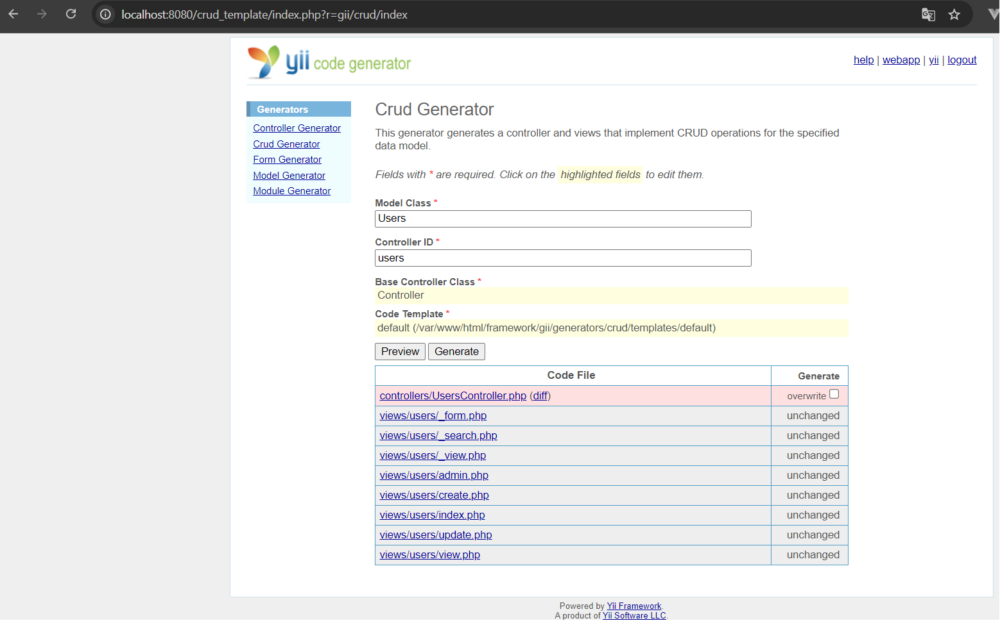

# Yii Web Programming Framework

Thank you for choosing Yii - a high-performance component-based PHP framework.

## INSTALLATION

Please make sure the release file is unpacked under a Web-accessible
directory. You shall see the following files and directories:

      demos/               demos
      framework/           framework source files
      requirements/        requirement checker
      CHANGELOG            describing changes in every Yii release
      LICENSE              license of Yii
      README               this file
      UPGRADE              upgrading instructions

## REQUIREMENTS

The minimum requirement by Yii is that your Web server supports
PHP 5.1.0 or above. Yii has been tested with Apache HTTP server
on Windows and Linux operating systems.

Please access the following URL to check if your Web server reaches
the requirements by Yii, assuming "YiiPath" is where Yii is installed:

      http://hostname/YiiPath/requirements/index.php

## QUICK START

Yii comes with a command line tool called "yiic" that can create
a skeleton Yii application for you to start with.

On command line, type in the following commands:

        $ cd YiiPath/framework                (Linux)
        cd YiiPath\framework                  (Windows)

        $ ./yiic webapp ../testdrive          (Linux)
        yiic webapp ..\testdrive              (Windows)

The new Yii application will be created at "YiiPath/testdrive".
You can access it with the following URL:

        http://hostname/YiiPath/testdrive/index.php

## WHAT's NEXT

Please visit the project website for tutorials, class reference
and join discussions with other Yii users.

The Yii Developer Team
https://www.yiiframework.com

---

# INSTRUCCIONES:

---

La arquitectura que utiliza es MVC:

### Comandos para crear una nueva webapp

<pre><code>docker compose exec php /bin/sh</code></pre>
<pre><code>cd framework</code></pre>
<pre><code>chmod -R +x yiic</code></pre>
<pre><code>./yiic webapp ../hello_world</code></pre>

Url de la aplicacción:
http://localhost/test_crud/

 

### [nombre_webapp]/protected/main.php

Para activar la conexión de la base de datos (.../protected/config/database.php):

<pre><code>'db'=>require(dirname(__FILE__).'/database.php')</code></pre>

Para activar las urls limpias:

<pre><code>'urlManager'=>array(
'urlFormat'=>'path',
'rules'=>array(
        '<controller:\w+>/<id:\d+>'=>'<controller>/view',
	'<controller:\w+>/<action:\w+>/<id:\d+>'=>'<controller>/<action>',
	'<controller:\w+>/<action:\w+>'=>'<controller>/<action>',
      ),
),</code></pre>

Para activar el generador de codigos GII:

<pre><code>'modules'=>array(
      // uncomment the following to enable the Gii tool
	'gii'=>array(
	      'class'=>'system.gii.GiiModule',
		'password'=>'12345678',
		// If removed, Gii defaults to localhost only. Edit carefully to taste.
		'ipFilters'=>array('127.0.0.1','::1', '192.168.1.*', '*'),
	),
),</code></pre>

URL para acceder al GII para crear modelos y CRUDS.
http://localhost:8080/crud_template/index.php?r=gii

 

### Migrations

Para crear una nueva migración:

<pre><code>cd [nombre_webapp]</code></pre>
<pre><code>./protected/yiic migrate create create_users_table</code></pre>
<pre><code>./protected/yiic migrate</code></pre>

 

### RUTAS

<pre><code>http://localhost:8080/crud_template/index.php?r=[controller]/[action]</code></pre>

 

### Components
Para añadir un nuevo componente:
<pre><code>'modelLoader' => array(
'class' => 'application.components.ModelLoader',
),</code></pre>

 

### MODEL

Devolver una instancia del modelo de base de datos.

<pre><code>public static function model($className = __CLASS__)
{
  return parent::model($className);
}</code></pre>

 

Public: Los miembros (propiedades y métodos) declarados como public son accesibles desde cualquier lugar.

Protected: Los miembros declarados como protected solo son accesibles desde dentro de la clase o desde clases que heredan de la clase original.

Private: Los miembros declarados como private solo son accesibles dentro de la propia clase en la que están definidos.

 

### DEBUG

<pre><code>$users = User::model()->with('role')->findAll();
foreach($users as $user) {
  CVarDumper::dump($user->getAttributes(), 1, true);
  die();
}</code></pre>

### Filtrar multiples condiciones
Se utiliza params y % para evitar inyecciones SQL.

<pre><code>$criteria = new CDbCriteria();

$product_name = 'Example Product';  

// $criteria->addCondition("name = :name AND price < :price");
$criteria->addCondition("name LIKE :name");
$criteria->addCondition("price > :price");

$criteria->params = array(
    ':name' => "%$product_name%",
    ':price' => 100,
);

$products = Product::model()->findAll($criteria);
</code></pre>

